# [GBA] Metroid Zero Mission - Tradução PT-BR

Este é um projeto de tradução do jogo Metroid Zero Mission, de Gameboy Advance, para português do Brasil.

Metroid Zero Mission é uma recriação extremamente fiel do clássico Metroid, primeiro jogo da série que foi lançado pra NES, e um dos primeiros jogos do console. O jogo possui a mesmíssima engine usada em Metroid Fusion, e seus detalhamentos são extremamente parecidos com os de Super Metroid de SNES. Além disso, o jogo se expande um pouco mais comparado ao original.

# Informações

Nome do jogo: Metroid Zero Mission

Versão: Americana

Plataforma: Gameboy Advance

Desenvolvedora: Nintendo

Distribuidora: Nintendo

Gênero: Plataforma / Metroidvania

Jogadores: 1

# Enredo

Em um futuro distante, líderes de vários planetas uniram-se e formaram uma assembléia legislativa chamada Federação Galáctica, onde seu objetivo era construir um universo justo e bem-estruturado, em prol do crescimento e prosperidade da sociedade. Sob a tutela dessa nova federação, seres dos mais distintos planetas passaram a conviver uns com os outros, inclusive criando novas civilizações. O ramo de transportes teve enorme desenvolvimento tecnológico, como a criação de Naves Espaciais Interestelares, dentre vários outros meios de transporte espacial.

Nessa época, o planeta Terra também entrou em contato com seres de outros planetas, consequentemente entrando em contato com a tecnologia deles, ao passo que compartilhava a sua. Tudo parecia bem nessa sociedade, até que inevitavelmente desenvolveu-se a criminalidade. Surgiram grupos inescrupulosos que passaram a atacar Naves Espaciais, roubando mercadorias valiosas. Passaram a ser conhecidos como "Piratas Espaciais".

Tentaram criar forças de combate para evitar esses ataques, mas mesmo com a avançada tecnologia da Federação Galáctica, os piratas eram extremamente difíceis de combater em meio espacial. Então, passaram a recrutar indivíduos corajosos que tornaram-se conhecidos como "Caçadores Espaciais", e os equiparam com as melhores armas disponíveis. A recompensa por matar piratas era altíssima.

Aproximadamente cinquenta anos se passaram desde então, e o universo continuava a se desenvolver, ao passo que ainda ocorriam conflitos violentos com esses piratas no espaço. Porém, surgiu algo que seria o prelúdio de acontecimentos catastróficos. Uma forma de vida até então desconhecida, de potencial tremendo, foi descoberta. Encontraram-na em SR388, um planeta deserto e misterioso. Não houve tempo de estudar o suficiente sobre tal forma de vida, mas pelo pouco que descobriram, soube-se que ao expô-la a raios beta por 24 horas, a mesma se multiplica. Alguns cientistas acreditaram que, devido à força e potencial exacerbados dessas formas de vida, outras espécies tornavam-se presas delas e eram erradicadas a ponto de praticamente entrarem em extinção, o que justificou o fato de não haver vida alguma além desses seres aptos no seu planeta natal. Decidiram chamar então essa forma de vida, de "Metroid". Era um ser de enorme potencial para diversos ramos, tanto benéficos quanto destrutivos.

Antes mesmo de descobrirem sobre o potencial dos Metroids, os Piratas Espaciais haviam já apoderado-se do planeta. A Federação temeu muito o reles fato de tal forma de vida estar em mãos de criminosos. Se os piratas soubessem como fazê-los se multiplicar, e então usá-los como arma biológica, as vítimas seriam incontáveis. Várias equipes de busca foram enviadas pela Federação, e por sorte descobriram o Quartel General dos piratas: um planeta chamado Zebes. No entanto, nenhuma das forças de ataque, enviadas a esse planeta, foram fortes o bastante para abater os piratas em seu QG.

Os Piratas Espaciais já estavam perto de dominar a multiplicação de Metroids. Desesperada por uma solução, a Federação decidiu que a única opção restante era infiltrar-se em Zebes e destruir o líder dos Piratas Espaciais, "Cérebro-Mãe". Para complicar, a estrutura subterrânea de Zebes era uma fortaleza natural que consistia de um labirinto gigante, e além disso haviam inúmeras armadilhas e aliados dos piratas em seu interior.

A Federação decide então enviar o mais hábil Caçador Espacial: uma mulher chamada Samus Aran. Embora seja humana, ela luta usando um traje cibernético capaz tanto de realizar ataques letais, como de defender-se precisamente. Até então, ela já havia completado inúmeras missões consideradas impossíveis.

Dando a ela a ordem de emergência, a missão de Samus é ir até Zebes, coincidentemente sua terra natal, destruir o Cérebro-Mãe e levar à extinção todos os Metroids da face deste planeta. Será ela capaz de tamanha missão?

# Sobre a tradução

Essa é uma tradução que iniciei desse jogo em meados de 2007, enquanto membro do finado grupo da Trans-Center. Já havia uma tradução para o Metroid Fusion, mas não para o Metroid Zero Mission, o que me motivou a seguir com o projeto, com o apoio de colegas como Ondinha, Darkl0rd e joapeer. Foi durante meus primeiros anos de romhacking, onde aprendi como lidar com dados comprimidos, editar tilemaps, encontrar OAMs, etc. Os gráficos comprimidos foram editados usando ferramentas como [unLZ-GBA](https://www.romhacking.net/utilities/362/) e [GBADecomp](https://gbatemp.net/download/gbadecmp-gbadecomp.37156/), e o Ondinha desenvolveu a ferramenta [MetroID](https://www.romhacking.net/utilities/459/) para extração e inserção de textos. Foi um projeto curto de alguns meses, tendo a versão 1.0 lançada no comecinho de 2008 com cerca de 95% do jogo traduzido.

Dezoito anos depois, em dezembro de 2025, Metroid Prime 4 foi lançado, este sendo o primeiro título da série a contar com uma localização oficial para português brasileiro. Com a localização, agora temos uma terminologia oficial, contendo termos como:

- Morph Ball: Morfosfera
- Power Bomb: Bomba Energética
- Grapple Beam: Raio de Arpéu
- Varia Suit: Traje Varia
- Metroid: Metroid (mantido original)

Antes da localização oficial existir, todas as fã-traduções foram feitas em avulso por diversos autores, com boa parte deles imaginando como seriam os termos se houvesse uma localização oficial. No meu caso, para citar de exemplo, eu havia optado por "Metroide", "Forma Esférica" e "Traje Climático", o que acabou se estendendo para a grande maioria das fã-traduções de jogos subsequentes.

No entanto, agora que temos uma localização oficial, e como um sinal de respeito pela Nintendo finalmente estar localizando a série Metroid para o nosso idioma, decidi criar a chamada "Iniciativa Metroid", cujo objetivo é revisitar todas as fã-traduções de Metroid para adequá-las à terminologia da localização PT-BR oficial da Nintendo, tendo esse [glossário](https://github.com/leomontenegro6/metroid-zero-mission-traducao-ptbr/blob/master/Anotacoes/Gloss%C3%A1rio.md) por base, onde inclusive reverteremos a adaptação "Metroide" previamente introduzida em traduções no passado. Essa iniciativa visa englobar não só os jogos vanilla oficiais, como também alguns hacks e fangames onde isso for aplicável. Para me auxiliar nessa empreitada, consegui vários colegas romhackers novos, para ajudar em coisas como revisão e teste ingame, desenvolvimento de novas ferramentas, alterar outros jogos, etc.

O primeiro título dessa iniciativa é o Metroid Zero Mission por ter sido o primeiro jogo de Metroid que mexi, e também por ser um jogo relativamente curto em termos de textos e gráficos a serem editados. Na parte textual, tentei inicialmente usar a ferramenta MetroID criada pelo Ondinha, mas a ferramenta tá defasada e só funciona em Python2, que foi deprecado em virtude do Python3, o que complicou o seu uso. Ao invés disso, Breno criou um novo dumper/inserter de textos em ARMIPS que permitiu fazermos todas as edições de uma forma mais moderna e confortável, de modo a incluir a terminologia oficial introduzida no Metroid Prime 4, somada a algumas correções textuais e de regras gramaticais.

Já na parte gráfica, ela foi largamente mantida intacta, exceto por um ou dois que precisaram mudar por conta da nova terminologia. Também tive uma breve ajuda do colega TTK, para me ajudar com as OAMs dos textos mostrados antes da tela-título. Além disso, a ROM foi expandida de 8mb pra 16mb, seguido de ter todos os assets traduzidos movidos pro final da região dos 16mb da ROM, de modo a facilitar tornar a tradução compatível com randomizers e alguns hacks como "ProjectZM" e "Super Metroid Revamp", feito este que foi possível graças ao apoio de colegas do servidor do discord do [Metroid Construction](https://metroidconstruction.com/).

A única coisa que continua intacta é o Metroid Original de NES que desbloqueamos após zerar o jogo. Fizemos uma análise mais profunda, e vimos que editar isso daria um trabalho considerável para algo de pouco retorno. Compensa mais mexer direto na ROM original de NES, o que nos permitiria também a ideia de estender a tradução para outros hacks, como Metroid + Saving e Metroid Rogue Dawn por exemplo.

A versão 1.1 da tradução conta com as seguintes novidades:

- Inclusão da terminologia oficial introduzida no Metroid Prime 4
- Correções textuais e de regras gramaticais.
- Tornada a tradução compatível com alguns hacks de aprimoramento, como:
  - [ProjectZM](https://metroidconstruction.com/hack.php?id=531): Hack que implementa uma série de aprimoramentos de QoL para o jogo original. Projetado para corrigir erros e adicionar novas rotas de gameplay, truques e mecânicas. É parecido com o que o Super Metroid Redux faz com o jogo original de SNES.
  - [Super Metroid Revamp](https://metroidconstruction.com/hack.php?id=709): Hack que tenta recriar o Super Metroid na engine do Metroid Zero Mission. É um sucessor do antigo "Super Metroid: GBA Edition".
  - [MZM Randomizer](https://www.romhacking.net/utilities/1371/): Permite gerar versões do jogo completamente aleatorizadas, com posições de itens trocadas, paletas de cor modificadas, etc. Para mais informações, veja a seção de perguntas e respostas.

Nos nossos testes, os hacks de aprimoramento acima funcionaram muito bem com a tradução, e eu consegui zerar o jogo com todos eles sem problemas. No entanto, para outros hacks além dos listados acima, será preciso fazer trabalhos adicionais de adaptação, o que pode ser relativamente trabalhoso. Caso alguém se interesse em tentar tornar a tradução compatível com algum outro hack, veja a seção de perguntas e respostas.

Com isso, lançamos a versão 1.1 da tradução, após quase 18 anos depois. Espero que usufruam desse trabalho, da mesma forma que também o fizemos nesse processo.

# Equipe

- **Solid One**: Romhacking geral, gráficos, tradução e teste;
- **Ondinha**: Desenvolvimento da antiga ferramenta MetroID de dumper/inserter em Python, em 2008;
- **Darkl0rd**: Revisão e teste ingame da versão 1.0 lá de 2008;
- **joapeer**: Gráficos e auxílio na tabela VWF da fonte;
- **Breno**: Desenvolvimento da nova ferramenta de dumper/inserter em ARMIPS;
- **TTK**: Auxílio na parte de romhacking das OAMs do prólogo do jogo;
- **Ted**: Retradução de trechos com base no original japonês, revisão e teste ingame;
- **lMRlAsura**: Revisão e teste ingame;

# Status da Tradução

Textos: 95%

Acentos: 97%

Gráficos: 100%

Revisão: 100%

# Perguntas e Respostas

**P1**: Como eu faço para combinar a tradução com os patches de aprimoramento, como ProjectZM e Super Metroid Revamp por exemplo?

**R1**: Junto ao arquivo zipado contendo o patch de tradução da versão vanilla, também estão patches opcionais contendo a tradução e cada patch de aprimoramento combinados. Optei por distribuir assim para facilitar o uso para usuários finais, e esses patches foram inclusos mediante permissão dos autores originais. 

**P2**: Vi que a versão nova aumentou o tamanho da ROM de 8mb para 16mb. Por que isso foi feito, se a rom tem espaço de sobra e não precisaria expandir?

**R2**: Isso foi feito para aumentar a compatibilidade da tradução com diversos hacks disponíveis, e para que o processo de patching seja simples sem necessitar de uma ferramenta de patcher. No entanto, nos nossos testes, mesmo a expansão da ROM pode não ser suficiente, e para cada hack pode ser necessário fazer customizações adicionais pós-aplicação da tradução.

**P3**: Tentei combinar o randomizer com os patches do ProjectZM e/ou Super Metroid Revamp, mas não funcionou. Isso é normal?

**R3**: De acordo com os autores, o randomizer só funciona com o jogo vanilla. Mesmo o ProjectZM sendo bem próximo ao original, as mudanças de gameplay feitas pelo randomizer ainda não são funcionais com as mecânicas adicionais do ProjectZM. O mesmo vale pro Super Metroid Revamp que, por introduzir um mapa completamente novo com habilidades em posições diferentes, complica bastante fazer o randomizer ser funcional para ele.

**P4**: Como eu faço para fazer a tradução funcionar com randomizers?

**R4**: Para roms randomizadas funcionarem, o processo é um pouquinho mais trabalhoso. Para isso, siga os passos:
1. Gere uma rom randomizada utilizando a ferramenta do MZM Randomizer (https://www.romhacking.net/utilities/1371/), escolhendo as opções que desejar;
2. Aplique o patch de tradução, o que deve garantir que a maioria dos assets traduzidos prevaleçam;
3. Aplique o patch de consertos pós-randomizador, para desfazer determinados assets da tradução que podem conflitar com o randomizer.
Dessa maneira, eu consegui zerar o jogo randomizado com um seed, e a tradução funcionou normalmente.

**P5**: O ProjectZM está fazendo uso do "Standard Patch" ou do "Unknown Items Enabled"?

**R5**: Estamos usando o "Standard Patch", por ser o padrão e mais recomendado para a maioria dos usuários. A versão de itens desconhecidos ativados é mais mirado para jogadores experientes e speedrunners. Caso queira tentar essa versão, veja a pergunta nº 6 abaixo.

**P6**: A tradução é compatível com outros hacks de aprimoramento, além dos mencionados?

**R6**: Até o momento, apenas o ProjectZM e o Super Metroid Revamp foram tornados compatíveis com a tradução. Para cada um deles, foi necessário fazer um volume de trabalho considerável que foi além de apenas mergear assets, chegando a precisar retraduzir diversos assets do jogo. Acredito que o mesmo talvez precise ser feito para outros hacks, o que seria bastante trabalhoso. No entanto, caso queira tornar algum outro hack compatível com a tradução, sinta-se livre de forkar o repositório e experimentar.

# Imagens

Versão Original:

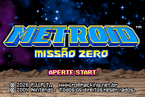 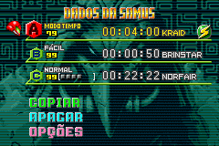 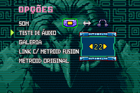

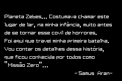 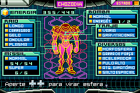 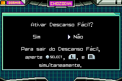

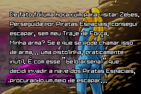 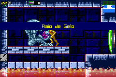 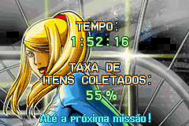

 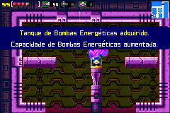 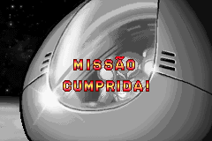

Versão ProjectZM:

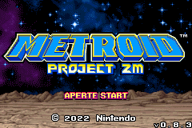 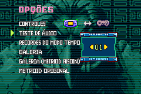 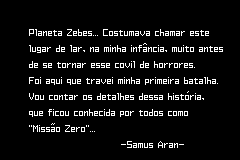

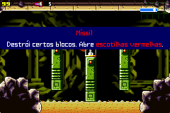 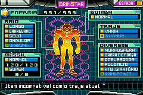 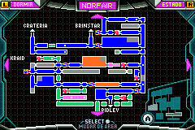

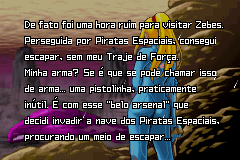 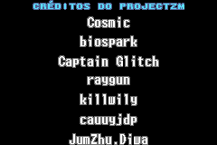

Versão SuperMetroidRevamp:

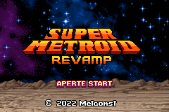 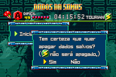 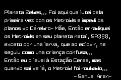

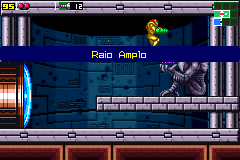  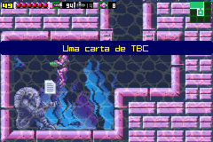

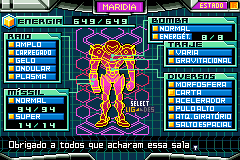 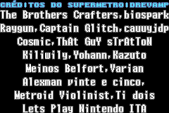

# Patch

O patch de tradução está disponível na seção de releases desse repositório. Está em formatos IPS ou BPS, e vocês podem aplicá-los através de programas como [Floating IPS](https://www.romhacking.net/utilities/1040/) ou similares.

Esta tradução pode ser aplicada na ROM "Metroid - Zero Mission (U) [!].gba", com header, de crc 5C61A844 / md5sum ebbce58109988b6da61ebb06c7a432d5.